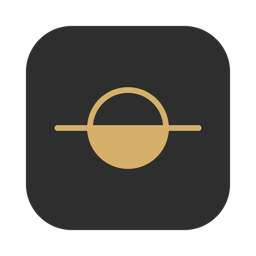

<h1 align="center">Mellow</h1>

Night Shift, but better. A Mac menu bar app that warms, dims and softens your screen, and reminds you to take breaks.

<a href="https://github.com/Inspiractus01/mellow-app/releases/latest/download/Mellow.dmg"><b>Download Mellow</b></a> · <a href="https://inspiractus01.github.io/mellow-app/">Website</a>

- Warms the screen, dims it and softens colors
- Automatic mode that follows sunset and your sleep
- Reminds you to look away every 20 minutes

Requires macOS 14 or later on an Apple Silicon Mac. The app isn't signed with an Apple Developer ID yet, so the first time macOS asks you to allow it in System Settings → Privacy & Security.

Feedback: lowsunlabs@proton.me

This repository holds the website and releases only. Mellow is not open source.

© 2026 Low Sun Labs
